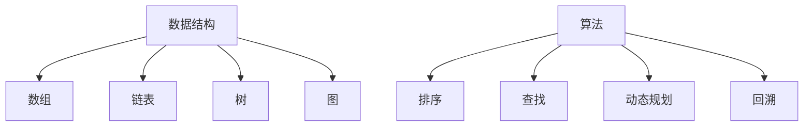

# 🚀 Algorithm Mastery - Zhou's Coding Journey

## 📌 仓库概览

🌈 知识体系

```mermaid
graph TD
A[数据结构] --> B[数组]
A --> C[链表]
A --> D[树]
A --> E[图]
F[算法] --> G[排序]
F --> H[查找]
F --> I[动态规划]
F --> J[回溯]
```

📈 学习轨迹
- 2025.7.10：开始数组模块练习
- 2025.7.15：开始链表模块练习

🤝 交流互动
欢迎提出建议或讨论算法问题！

 持续更新中 · 欢迎Star ⭐ 

